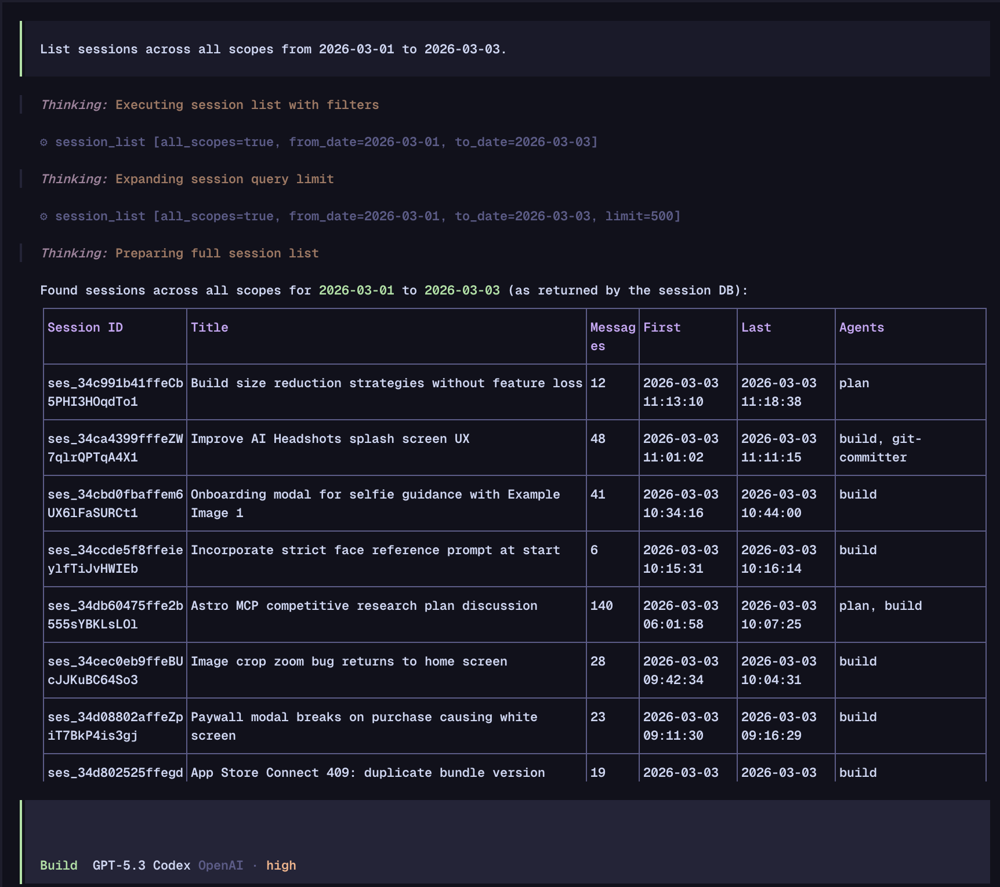

# opencode-session-manager

OpenCode plugin that turns your past sessions into something you can actually reuse.

It adds four tools:

- `session_list`
- `session_read`
- `session_search`
- `session_info`

## Why this is useful

This plugin is most helpful when your current session is full and you need to keep moving.

Example workflow:

1. Start a new session.
2. Ask OpenCode: "Review our last session and continue from where we left off."
3. It can find and read the previous session, then pick up the work.

It is also useful when:

- you remember discussing something but forgot the details
- you want OpenCode to recall a decision from a past session
- you need to find where a bug, fix, or plan was originally discussed

In practice, it feels like a lightweight memory system built on your own local session history.

## What the tools do

- `session_list`: list recent sessions with title, timestamp, message count, and agents used
- `session_read`: read messages from a specific session in order
- `session_search`: search text across sessions (or within one session)
- `session_info`: show summary metadata for a session

Useful options:

- `all_scopes: true` searches across all workspaces
- `from_date` / `to_date` support date-only input (`YYYY-MM-DD`) and treat full days as inclusive
- timestamps are rendered in the runtime's local timezone (no config required for local usage)

Optional agent hint: if your agent often misses prior-session context, add this to your `AGENTS.md`: `When asked about prior work/decisions, use session tools first: session_list -> (optional all_scopes/date filters) -> session_info/session_read -> session_search.`

## Install

### From npm (recommended)

Add this to `~/.config/opencode/opencode.jsonc` (or project `opencode.json`):

```jsonc
{
  "plugin": ["opencode-session-manager"],
}
```

### From source (local development)

```bash
bun install
bun run build
```

Then point OpenCode at your local build:

```jsonc
{
  "plugin": ["/absolute/path/to/opencode-session-manager/dist/index.js"],
}
```

## Example prompts

- "What did we work on last session?"
- "Review our last session and continue from where we left off."
- "Search past sessions for where we discussed OAuth token refresh."
- "What did we decide last week about the session manager date filter?"
- "List sessions across all scopes from 2026-03-01 to 2026-03-03."

### Example outputs

Prompt: `What did we work on last session?`

```text
Last session summary:
- Added date-range support (`from_date` / `to_date`) to `session_list`
- Fixed inclusive end-of-day handling for date-only inputs
- Added tests for cross-scope filtering
```

Prompt: `Review our last session and continue from where we left off.`

```text
I reviewed session `ses_demo_01`. We completed the parser update and left off before wiring docs.

Next step I will take now:
1. Update README examples for `all_scopes` and date filters
2. Add one integration test for mixed date formats
```

Prompt: `Search past sessions for where we discussed OAuth token refresh.`

```text
Found 3 relevant matches:
- ses_demo_14 (2026-02-18): "rotate refresh token on each use"
- ses_demo_19 (2026-02-22): "handle 401 with single-flight refresh"
- ses_demo_27 (2026-02-28): "store token expiry as epoch ms"
```

Prompt: `What did we decide last week about the session manager date filter?`

```text
Decision recap (last week):
- Date-only values (`YYYY-MM-DD`) are interpreted in local time
- `to_date` is inclusive through 23:59:59.999
- Invalid dates return a clear validation error
```

Prompt: `List sessions across all scopes from 2026-03-01 to 2026-03-03.`

```text
Sessions found across all scopes (2026-03-01 to 2026-03-03):

| Session ID    | Title                         | Messages | Last                |
|---------------|-------------------------------|----------|---------------------|
| ses_demo_31   | Session search perf pass      | 24       | 2026-03-03 18:42:10 |
| ses_demo_30   | README examples cleanup       | 11       | 2026-03-03 09:14:02 |
| ses_demo_28   | Date filter bug investigation | 37       | 2026-03-02 21:03:44 |
| ses_demo_25   | Initial plugin scaffolding    | 19       | 2026-03-01 16:27:51 |
```

### Example



## Development

```bash
bun run typecheck
bun run build
bun test
```

## Compatibility

- OpenCode plugin API: `@opencode-ai/plugin >= 1.0.0`
- Verified with `@opencode-ai/plugin 1.2.x`

## License

MIT
